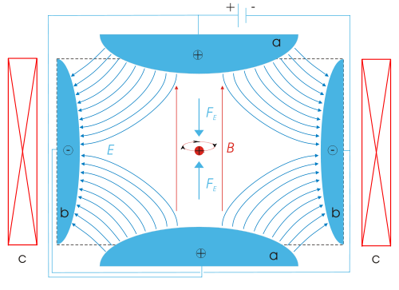
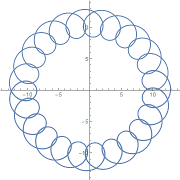
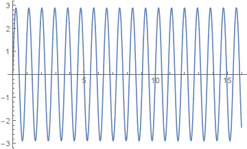
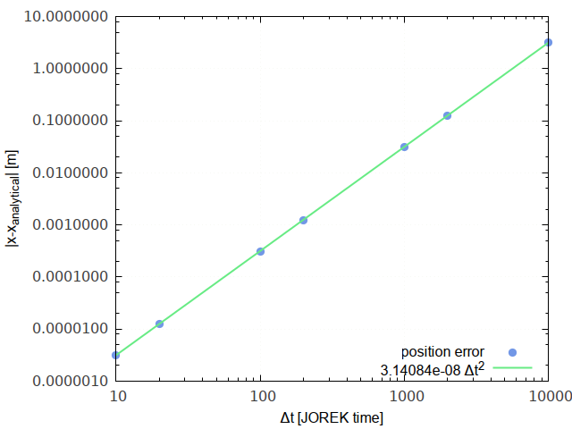
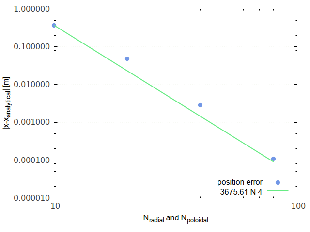

title: Penning trap test

This is a document describing the implementation of a penning trap test
for particles. This is one of the integration tests used to keep the
JOREK source code stable. The testcase is located in
*non\_regression\_tests/jorek2\_particles/penning\_test*. Running it is done
using the *particle_penning_test.sh* program, which compiles *penning.f90* and runs it for
all files in the folders *\*_cases/*.

## The Penning trap field

The Penning trap consists of a constant, uniform magnetic field
\(\mathbf{B}_0\) in the \(z\)-direction, and a quadrupole electric
field. An example is shown below. (Image from [Wikimedia, by Arian
Kriesch](https://commons.wikimedia.org/wiki/File:Penning_Trap.svg))

### Parameters

The independent parameters (in SI units) used in the test are

| Parameter | Value | Description |
|-----------|-------|-------------|
| \(\omega_e\) | 4.9 rad/s | Oscillation frequency of the particle due to the electric field |
| \(\omega_b\) | 25.0 rad/s | Oscillation frequency of the particle due to the magnetic field |
| \(\epsilon\) | -1 | Polarisation of the penning trap | 
| \(\mathbf{x}_0\) | (10,0,0) m | Initial position (in xyz coordinates) |
| \(\mathbf{v}_0\) | (50,0,20) m/s | Initial velocity (in xyz coordinates) |

For these parameters the particle trajectory has been [calculated](penning_trap.nb).
The x-y position of the particle over time is shown in the figure below.
The motion in the \(z\)-direction is decoupled and is a simple harmonic oscillator.

#### Converting to JOREK units

We can calculate the fields required to obtain this motion for a
specific value of \(q/m\) in JOREK units, using the reference time
\(t\_{norm} = \sqrt{\mu_0\rho_0}\).

| Parameter | SI | JOREK |
|-----------|----|-------|
| \(\mathbf{B}_0\) | \(\omega_b m / q\) | same |
| \(\Phi_0\) | \(\frac{1}{2}\epsilon \omega_e^2 m/q\) | \(0.5\epsilon \omega_e^2 (m/q) t_{norm}\) |

We also need to convert the velocity \(\mathbf{v}_{0,SI}\) to JOREK
units by multiplying it with \(t_{norm}\).

#### The particle equation of motion

The motion of the particle is governed by two equations (in SI units),
\[
  \frac{\mathrm{d}\mathbf{x}}{\mathrm{d}t} = \mathbf{v}, \label{eq:dx}
\]
and
\[
  \frac{\mathrm{d}\mathbf{v}}{\mathrm{d}t} = \frac{q}{m} \left(\mathbf{E} + \mathbf{v} \times \mathbf{B}\right). \label{eq:dv_SI}
\]
In JOREK units this is slightly different
\[
  \frac{\mathrm{d}\mathbf{v}}{\mathrm{d}t} = \left(\frac{q}{m}\right)_{\mathrm{SI}} t_{norm} \left(\mathbf{E} + \mathbf{v} \times \mathbf{B}\right). \label{eq:dv}
\]

##### Expected test results

This test compares the position at JOREK time \(\tilde t = 1.6 \cdot
10^8\) to the reference position at that point. The norm of the
difference vector \(\mathbf{x} - \mathbf{x}_{analytical}\) is
calculated. In the folders *dt\_results* and *n\_radial\_results* plots
are produced of the error scaling. Some of these have been included
below.

#### Error scaling with timestep size

Since the particle tracking method (Boris scheme) is second-order, the
convergence to this value should be second-order as well. An excellent
fit is obtained. If the error is higher than \(1.2 \cdot
3.14084\cdot 10^{-8} \Delta t^2\) the program will exit with an error
and the test fails. In the graph below this error is shown for different
time step sizes, in the case *00\_single\_element\_square*.

#### Error scaling with element size

The field cannot be perfectly reconstructed in a polar grid, therefore
the margin built in the check is 20 %. Increasing the number of elements
lowers this error. The graph below shows the scaling of the error with
the number of elements. This should be fourth order, and constitutes a
test of the reproduction of the field in the JOREK finite elements. The
timestep used is 20. 

